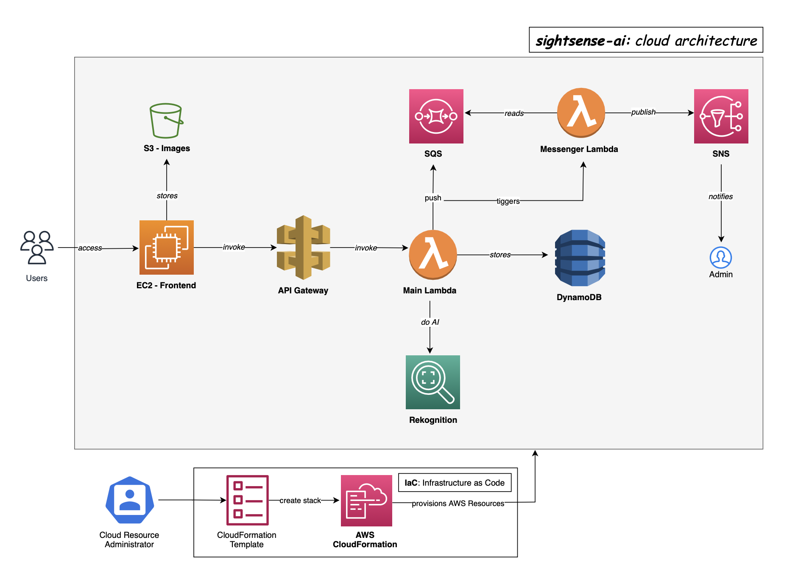

## SightSense-AI

### Architecture:

### Key Features:

**Image Labelling:** Users can upload images to application and receive detected labels based on AI - Rekognition. The image gets added to Gallery.

**Image Gallery:** The platform hosts an image gallery accessible to all users, showcasing a diverse range of images uploaded by the community. The users can search images by detected labels, and uploaded user’s email.

**Content Flag:** The application implements a content moderation system to prevent the upload of inappropriate, offensive, or unwanted content using AI - Rekognition. The admin is notified with flagged content and related information.

### AWS Services:

**Compute:** EC2, Lambda
**Storage:** S3, DynamoDB
**Network:** API Gateway
**General:** Rekognition, SQS, SNS
**IaC**: CloudFormation

